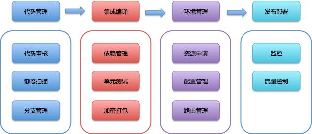

这个从编码到构建再到测试的反复持续过程，就叫作“持续集成”

 “持续集成”一旦完成，则代表产品处在一个可交付状态，但并不代表这是最优状态，还需要根据外部使用者的反馈逐步优化。当然这里的使用者并不一定是真正的用户，还可能是测试人员、产品人员、用户体验工程师、安全工程师、企业领导等等。

**这个在“持续集成”之后，获取外部对软件的反馈再通过“持续集成”进行优化的过程就叫作“持续交付”，它是“持续集成”的自然延续。**

那“持续部署”又是什么呢？软件的**发布和部署通常是最艰难的一个步骤**。

传统安装型软件，要现场调试，要用户购买等等，其难度可想而知。即使是可达度最高的互联网应用，由于生产环境的多样性（各种软件安装，配置等）、架构的复杂性（分布式，微服务）、影响的广泛性（需要灰度发布）等等，就算产品已是待交付的状态，要真正达到用户可用的标准，还有大量的问题需要解决。

**而“持续部署”就是将可交付产品，快速且安全地交付用户使用的一套方法和系统，它是“持续交付”的最后“一公里”。**

可见，“持续交付”是一个承上启下的过程，它使“持续集成”有了实际业务价值，形成了闭环，而又为将来达到“持续部署”的高级目标做好了铺垫。

虽然从概念上你可以这样理解，但从实践和我个人多年的经验来说，往往是从“持续部署”（自动化发布）开始推进“持续交付”，这才是一条优选的路径。这部分内容我会在后续文章中详细介绍。

我们会将所有的“**不可持续点”进行记录和分解**，通过 OKR 的考评方式，将消灭这些点作为目标，拆解出来的可行动点，作为关键结果，以这样的方式来完成绩效考评

**预发布**

根据不同的业务需求和部署策略，不同公司对预发布环境的实现也有所不同：

- 一种比较常见的方式是，将金丝雀发布作为预发布，从接入真实流量的集群中挑选一台或一小组机器先进行版本更新，通过手工测试以及自动化测试和监控系统验证，降低新版本发布的风险。
- 另一种做法是，独立出一组始终不接入真实流量的机器，调用在预发布环境中形成闭环。

相对于第一种方式，第二种方式对生产环境的影响更小，但需要额外的资源和维护成本。

**配置管理：** 是通过技术或行政手段对软件产品及其开发过程和生命周期进行控制、规范的一系列措施。 它的目标是记录软件产品的演化过程，确保软件开发者在软件生命周期的各个阶段都能得到精确的产品配置信息。

**配置：** 是指独立于程序之外，但又对程序产生作用的可配变量。也就是说，同一份代码在不同的配置下，会产生不同的运行结果。

从上面的定义中，你可以看到配置和配置管理有着本质上的不同：配置管理服务于软件研发过程，而配置则服务于程序本身。

**如果我们把这些信息都硬编码在代码里，结果就是：每次发布因为环境不同，或者业务逻辑的调整，都要修改代码。而代码一旦被修改，就需要完整的测试，那么变更的代价将是巨大的。**

**但是，“配置”本身也很讲究。在什么阶段进行配置，采用什么手段进行配置，都将直接影响持续交付的效果。**

而持续交付有一个核心概念，即：**一次构建多次部署**。打包就是为了解决这个问题而被发明的。

- CI 方面，与传统方式的不同只在于，原先交付的是安装包或软件包，而容器交付的则是镜像；
- CD 方面，与传统方式相比则有了长足的进步。
  对传统方式而言，部署和安装方式与软件类型、开发方式有直接关系，存在多种多样的可能。
  而容器技术则没有这样的问题，唯一的方式就是拉起容器镜像。这就大大简化了部署的复杂度，而且在编排系统的支持下，完成 CD 越来越容易了。

### 利用Kaniko构建容器镜像

http://www.dockone.io/article/10406

## 不可变基础设施的神话

http://www.infrastructures.org/papers/turing/turing.html

1. **顺序问题**：你只有完全保证顺序的正确性，结果才会正确。但是，怎么保证顺序呢？特别是执行结果与你的预期不一致时，比如发生错误时，就会多出一些其他的处理步骤，直接影响原有的既定顺序。这也是为什么顺序那么重要的原因。
2. **频率问题**：假设你可以通过一些方法保证顺序，在面对大型基础设施时，应该如何制定收敛频率呢？最简单的回答，自然是越频繁越好。
   那么你就会陷入巨大的陷阱中，你会发现完全无法支撑并发的收敛工作。而且收敛工作与设施的规模成正比，直接否定了系统的可扩展性。
3. **蝴蝶效应**：你始终无法确定一个绝对的基准点，认为是系统的初始或者当前应该有的状态。因为你始终还在收敛中，只是无限趋近。因此任何小偏差，都会引起将来重大的、不可预知的问题。这就是蝴蝶效应。

**“第一座大山”：测试数据的准备和清理。**

通常情况下，回归测试的用例是可以复用的，所以比较固定，结果校验也比较确定。而如果要实现回归测试的自动化，就需要保证每次测试时的初始数据尽量一致，以确保测试脚本可复用。

如果每次的数据都不同，那么每次的测试结果也会受到影响。为了做到测试结果的可信赖，就有两种方法：

- **一种是，每次全新的测试都使用全新初始化数据；**
- 另一种是，在测试完成后，清除变更数据，将数据还原。

但是，这两种方法的实现，都比较麻烦，而且很容易出错

**“第二座大山”：分布式系统的依赖。**

分布式系统因为有服务依赖的问题，所以进行一些回归测试时，**也会存在依赖的问题**。这个问题，在持续交付中比较难解决：

1. **单元测试时要面对两难选择，测依赖还是不测依赖；**
2. 集成测试时，如何保证依赖服务的稳定性，**或者说排除由稳定性带来的干扰**，所以到底是依赖服务的问题，还是被测服务的问题很难确定；
3. 真实的业务系统中，往往还存在多层依赖的问题，你还要想办法解决被测应用依赖的服务的依赖服务。

**“第三座大山”：测试用例的高度仿真。**

**如何才能模拟出和用户一样的场景，一直困扰着我们**。

如果我们的回归测试不是自己设计的假想用例，而是真实用户在生产环境中曾经发生过的实际用例的话，那么肯定可以取得更好的回归测试效果。那么，有没有什么办法或技术能够帮助我们做到这一点呢？

- 不要 mock 非你所有的类型
- 不要 mock 值对象
- 不要 mock 所有的东西

**基于微服务的 Mock**

基于微服务的 Mock，我个人比较推荐的框架是 Weir Mock 和 Mock Server。这两个框架，都可以很好地模拟 API、http 形式的对象。

https://github.com/mock-server/mockserver

[WireMock - WireMock](http://wiremock.org/)

## 两大利器之二“回放”技术

**要做到和实际用户操作一致，最好的方法就是记录实际用户在生产环境的操作，然后在测试环境中回放。**

- 第一种方案是，在统一的 SLB 上做统一的拦截和复制转发处理。这个方案的好处是，管理统一，实现难度也不算太大。但问题是，SLB 毕竟是生产主路径上的处理服务，一不小心，就可能影响本身的路由服务，形成故障。所以，我们有了第二种替换方案。
- 第二种方案是，在集群中扩容一台服务器，**在该服务器上启动一个软交换，由该软交换负责复制和转发用户请求，而真正的用户请求，仍旧由该服务器进行处理。**
  这个方案比第一种方案稍微复杂了一些，但在云计算的支持下，却显得更经济。你可以按需扩容服务器来获取抽样结果，记录结束后释放该服务器资源。这个过程中，你也不需要进行过多的配置操作，就和正常的扩容配置一样，减少了风险。

## 持续交付为什么要实现平台化？

持续交付要做到平台化的原因，主要可以归结为以下三方面。

1. **随着软件技术的发展，任何企业最终都将面临多技术栈的现实**。不同的技术栈，就意味着不同的标准、不同的工具、不同的方式，所以我们就必须要通过合理的持续交付平台，去解决不同技术栈的适配工作。
2. **随着持续交付业务的发展，团队会越来越庞大，分工也会越来越明细**。这就要求持续交付体系能够支持更大规模的并发处理操作，同时还要不断地提升效率。更重要的是，当持续交付成为企业研发的生命线时，它必须做到高可用，否则一旦停产，整个研发就停产了。
3. **随着持续交付技术本身的发展，还会不断引入新的工具，或新的流程方法**。如果我们的持续交付体系不能做到快速适应、局部改造、高可扩展的话，那它自身的发展与优化将会面临严峻的挑战。

1. 具体需要做哪些工作；
2. 资源有限时，如何取舍；
3. 最重要的任务是什么；
4. 外部对你的限制和帮助有哪些。

**第一步，确定模块及其范围**

持续交付平台的工作流程基本就是根据这个流水线确定的，即：由编码开始，经过集成编译，再部署到相应环境，进行测试，最后发布到生产环境的过程。

持续交付平台最终将完成这个端到端的过程，那么流水线的每一步都可以认为是一个模块。由此，整个平台的核心模块就是**：代码管理、集成编译、环境管理、发布部署**。

这四个模块是持续交付平台中最核心，最容易做到内聚和解耦的模块。每个核心模块的周围，又围绕着各种子模块，比如：

- 代码管理模块，往往会和代码审核、静态扫描和分支管理等模块相联系；
- 集成编译模块，也会与依赖管理、单元测试、加密打包等模块相生相随的；
- 环境管理模块，离不开配置管理、路由管理等模块；
- 发布部署模块，还需要监控模块和流控模块的支持。

**第二步，学会做减法**

好的产品，都需要不断地做减法，持续交付平台也是如此。

我们已经在第一步罗列了需要完成的模块，**但很显然，不可能一下子完成所有的这些模块设计和开发 a**。所以，持续交付平台设计的第二步，**就如何抓住最核心的内容**

因此，**我们就可以考虑挑选最为重要或最为急迫的模块，优先加以实施。甚至，你可以优先实现这四个模块中的一个，先解决一部分问题。这样做减法的方式，我们称为横向缩小范围。**

**另外一种做减法的方式是减少纵向的深度**。也就是优先支持单一的技术栈，或特定的、比较简单的场景，比如先搞定组织内的单体应用。

**第三步，制定标准**

**研发任何系统，首先要记住一句话：“标准先行”。**

我们谈到标准时，往往会涉及很多方面，比如：对外衔接的标准、对内沟通的标准；质量的标准，速度的标准等等。而**对持续交付平台的设计来说，最重要的标准是定义各个模块交付产物的标准。**

- 比如，代码管理模块，最终的交付产物到底是什么，形式又是什么：是一个代码包，还是 git 仓库地址；
- 又比如，发布部署模块，到底执行的是怎样的过程：重启应用是使用线程回收机制，还是进程重启机制；

