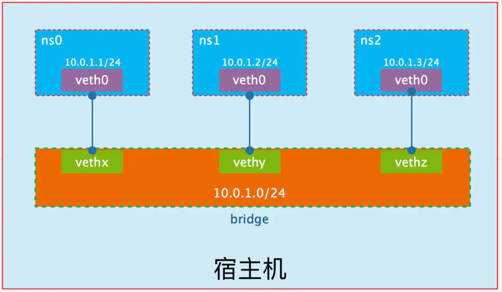

### docker网络

https://www.jianshu.com/p/f86d4b88777d

https://blog.csdn.net/meltsnow/article/details/94490994

https://blog.csdn.net/meltsnow/article/details/94490994

网络模式	简介
Host		容器将不会虚拟出自己的网卡，配置自己的IP等，而是使用宿主机的IP和端口。
Bridge	此模式会为每一个容器分配、设置IP等，并将容器连接到一个docker0虚拟网桥，通过docker0网桥以及Iptables nat表配置与宿主机通信。
None	 该模式关闭了容器的网络功能。
Container	创建的容器不会创建自己的网卡，配置自己的IP，而是和一个指定的容器共享IP、端口范围。


## Network Namespace

Network Namespace 是 Linux 内核提供的功能，是实现网络虚拟化的重要功能，它能创建多个**隔离**的网络空间，它们有独自网络栈信息。不管是虚拟机还是容器，运行的时候仿佛自己都在独立的网络中。而且不同Network Namespace的资源相互不可见，彼此之间无法通信。


### ip netns命令

可以借助`ip netns`命令来完成对 Network Namespace 的各种操作。`ip netns`命令来自于`iproute2`安装包，一般系统会默认安装，如果没有的话，读者自行安装。


注意：`ip netns`命令修改网络配置时需要 sudo 权限。

可以通过`ip netns`命令完成对Network Namespace 的相关操作，可以通过`ip netns help`查看命令帮助信息：


```shell
$ ip netns help
Usage: ip netns list
       ip netns add NAME
       ip netns set NAME NETNSID
       ip [-all] netns delete [NAME]
       ip netns identify [PID]
       ip netns pids NAME
       ip [-all] netns exec [NAME] cmd ...
       ip netns monitor
       ip netns list-id
```


### 创建Network Namespace

下面，我们通过命令创建一个名为`ns0`的命名空间：

```ruby
$ ip netns add ns0
$ ip netns list
ns0
```


新创建的 Network Namespace 会出现在**`/var/run/netns/`**目录下。如果相同名字的 namespace 已经存在，命令会报`Cannot create namespace file "/var/run/netns/ns0": File exists`的错误。

对于每个 Network Namespace 来说，**它会有自己独立的网卡、路由表、ARP 表、iptables 等和网络相关的资源。**


`ip`命令提供了`ip netns exec`子命令可以在对应的 Network Namespace 中执行命令。

1. 查看新创建 Network Namespace 的网卡信息


```csharp
$ ip netns exec ns0 ip addr
1: lo: <LOOPBACK> mtu 65536 qdisc noop state DOWN group default qlen 1000
    link/loopback 00:00:00:00:00:00 brd 00:00:00:00:00:00
```

可以看到，新创建的Network Namespace中会默认创建一个`lo`回环网卡，此时网卡处于`关闭`状态。此时，尝试去 ping 该`lo`回环网卡，会提示`Network is unreachable`

```python
$ ip netns exec ns0 ping 127.0.0.1
connect: Network is unreachable
```

```bash
ip netns exec ns0 ip link set lo up
```


### 转移设备

我们可以在不同的 Network Namespace 之间转移设备（如veth）。由于一个设备只能属于一个 Network Namespace ，所以转移后在这个 Network Namespace 内就看不到这个设备了。

其中，veth设备属于可转移设备，而很多其它设备（如lo、vxlan、ppp、bridge等）是不可以转移的。

veth pair **全称是 Virtual Ethernet Pair**，**是一个成对的端口**，所有从这对端口一 端进入的数据包都将从另一端出来，反之也是一样。
 引入veth pair是为了在不同的 Network Namespace 直接进行通信，**利用它可以直接将两个 Network Namespace 连接起来。**
 整个veth的实现非常简单，有兴趣的读者可以参考源代码`drivers/net/veth.c`的实现。


### 创建veth pair


```ruby
$ sudo ip link add type veth
$ ip addr
61: veth0@veth1: <BROADCAST,MULTICAST,M-DOWN> mtu 1500 qdisc noop state DOWN group default qlen 1000
    link/ether e6:39:e1:e0:3a:a0 brd ff:ff:ff:ff:ff:ff
62: veth1@veth0: <BROADCAST,MULTICAST,M-DOWN> mtu 1500 qdisc noop state DOWN group default qlen 1000
    link/ether be:41:49:42:23:6a brd ff:ff:ff:ff:ff:ff
```


可以看到，此时系统中新增了一对veth pair，将veth0和veth1两个虚拟网卡连接了起来，此时这对 veth pair 处于”未启用“状态。

如果我们想指定 veth pair 两个端点的名称，可以使用下面的命令：

```rust
ip link add vethfoo type veth peer name vethbar
```


### 实现Network Namespace间通信

下面我们利用veth pair实现两个不同的 Network Namespace 之间的通信。刚才我们已经创建了一个名为`ns0`的 Network Namespace，下面再创建一个信息Network Namespace，命名为`ns1`

```ruby
$ ip netns add ns1
$ ip netns list
ns1
ns0
```

然后我们将veth0加入到ns0，将veth1加入到ns1，如下所示：

```bash
$ ip link set veth0 netns ns0
$ ip link set veth1 netns ns1
```

然后我们分别为这对veth pair配置上ip地址，并启用它们：


```bash
$ ip netns exec ns0 iplink set veth0 up
$ ip netns exec ns0 ip addr add 10.0.1.1/24 dev veth0
$ ip netns exec ns1 iplink set veth1 up
$ ip netns exec ns1 ip addr add 10.0.1.2/24 dev veth1
```


```ruby
$ ip netns exec ns0 ip addr
61: veth0@if62: <BROADCAST,MULTICAST,UP,LOWER_UP> mtu 1500 qdisc noqueue state UP group default qlen 1000
    link/ether e6:39:e1:e0:3a:a0 brd ff:ff:ff:ff:ff:ff link-netnsid 1
    inet 10.0.1.1/24 scope global veth0
       valid_lft forever preferred_lft forever
    inet6 fe80::e439:e1ff:fee0:3aa0/64 scope link
       valid_lft forever preferred_lft forever

$ ip netns exec ns1 ip addr
62: veth1@if61: <BROADCAST,MULTICAST,UP,LOWER_UP> mtu 1500 qdisc noqueue state UP group default qlen 1000
    link/ether be:41:49:42:23:6a brd ff:ff:ff:ff:ff:ff link-netnsid 0
    inet 10.0.1.2/24 scope global veth1
       valid_lft forever preferred_lft forever
    inet6 fe80::bc41:49ff:fe42:236a/64 scope link
       valid_lft forever preferred_lft forever
```


### veth查看对端

一旦将veth pair的peer段放入另一个Network Namespace，我们在当前Namespace中就看不到它了。那么，我们怎么才能知道这个veth pair的对端在哪里呢？
 可以通过`ethtool`工具来查看（当Network Namespace很多时，操作会比较麻烦）：


```bash
$ ip netns exec ns1 ethtool -S veth1
NIC statistics:
    peer_ifindex: 5
```

得知另一端的接口设备序列号是5，我们再到另一个命名空间中查看序列号5代表什么设备：

```bash
$ ip netns exec ns0 ip link | grep 5
veth0
```


## 网桥

**veth pair打破了 Network Namespace 的限制**，实现了不同 Network Namespace 之间的通信。但veth pair有一个明显的缺陷，**就是只能实现两个网络接口之间的通信**。
 如果我们想实现多个网络接口之间的通信，就可以使用下面介绍的网桥（Bridge）技术。
 简单来说，**网桥就是把一台机器上的若干个网络接口“连接”起来**。其结果是，其中一个**网口收到的报文会被复制给其他网口并发送出去**。以使得网口之间的报文能够互相转发。


### 网桥的工作原理

网桥对报文的转发基于**MAC地址**。网桥能够解析收发的报文，读取目标**MAC地址的信息**，和自己记录的**MAC表结合，来决策报文的转发目标网口**。

为了实现这些功能，网桥会学习源MAC地址，在转发报文时，网桥只需要向特定的网口进行转发，从而避免不必要的网络交互。

如果它遇到一个自己从未学习到的地址，就无法知道这个报文应该向哪个网口转发，就将报文广播给所有的网口（报文来源的网口除外）。

https://upload-images.jianshu.io/upload_images/13618762-a5a16e12111adb27.png?imageMogr2/auto-orient/strip|imageView2/2/w/1200/format/webp




### 网桥的实现

Linux内核是通过一个虚拟的网桥设备（Net Device）来实现桥接的。这个虚拟设备可以绑定若干个以太网接口设备，从而将它们桥接起来。如下图所示：


如上图所示，网桥设备 br0 绑定了 eth0 和 eth1。

对于网络协议栈的上层来说，只看得到 br0，上层协议栈需要发送的报文被送到 br0，网桥设备的处理代码判断报文该被转发到 eth0 还是 eth1，或者两者皆转发；反过来，从eth0 或 eth1 接收到的报文被提交给网桥的处理代码，在这里会判断报文应该被转发、丢弃还是提交到协议栈上层。

而有时eth0、eth1 也可能会作为报文的源地址或目的地址，直接参与报文的发送与接收，从而绕过网桥。


### brctl

和网桥有关的操作可以使用命令 brctl，这个命令来自 bridge-utils 这个包。

1. 创建网桥

```bash
# 创建网桥
brctl addbr br0 
```

1. 删除网桥

```bash
# 删除网桥
brctl delbr br0
```

3绑定网口
 建立一个逻辑网段之后，我们还需要为这个网段分配特定的端口。在Linux 中，一个端口实际上就是一个物理或虚拟网卡。而每个网卡的名称则分别为eth0 ，eth1 ，eth2 。我们需要把每个网卡一一和br0 这个网段联系起来，作为br0 中的一个端口。

```bash
# 让eth0 成为br0 的一个端口
brctl addif br0 eth0  
# 让eth1 成为br0 的一个端口
brctl addif br0 eth1
# 让eth2 成为br0 的一个端口
brctl addif br0 eth2
```


## iptables/netfilter

iptables是Linux实现的软件防火墙，用户可以通过iptables设置请求准入和拒绝规则，从而保护系统的安全。
 我们也可以把iptables理解成一个客户端代理，用户通过iptables这个代理，将用户安全设定执行到对应的安全框架中，这个“安全框架”才是真正的防火墙，这个框架的名字叫`netfilter`。
 iptables其实是一个命令行工具，位于用户空间。

iptables/netfilter(以下简称iptables)组成了Linux平台下的包过滤防火墙，可以完成封包过滤、封包重定向和网络地址转换（NAT）等功能。

### 消息处理链

iptables不仅要处理本机接收到的消息，也要处理本机发出的消息。这些消息需要经过一系列的”关卡“才能被本机应用层接收，或者从本机发出，每个”关卡“担负着不同的工作。这里的”关卡“被称为”链“。

- `INPUT`：进来的数据包应用此规则链中的策规则；
- `OUTPUT`：外出的数据包应用此规则链中的规则；
- `FORWARD`：转发数据包时应用此规则链中的规则；
- `PREROUTING`：对数据包作路由选择前应用此链中的规则（所有的数据包进来的时侯都先由这个链处理）；
- `POSTROUTING`：对数据包作路由选择后应用此链中的规则（所有的数据包出来的时侯都先由这个链处理）；

