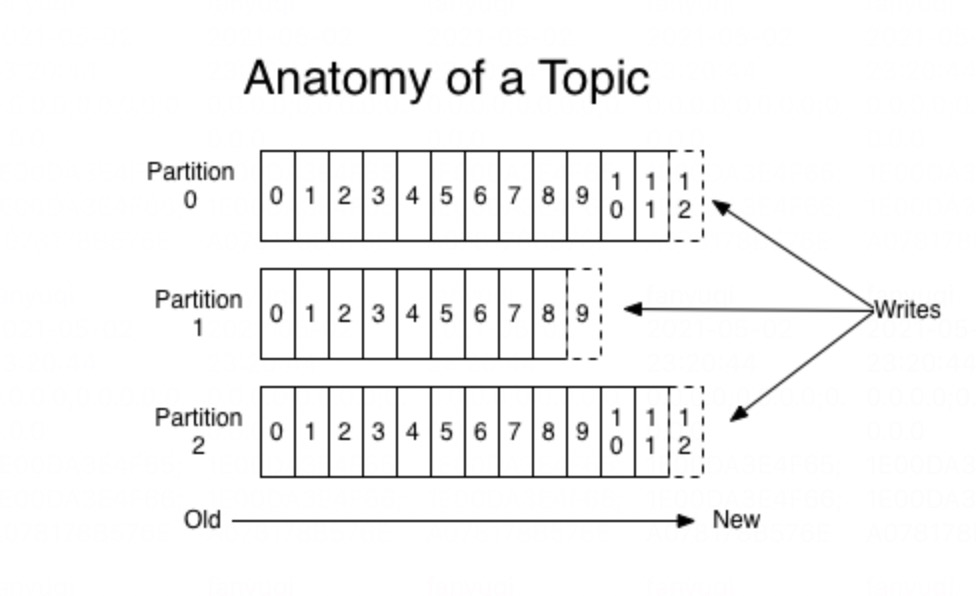

其实分区的作用就是**提供负载均衡的能力**，或者说对数据进行分区的主要原因，就是为了实现系统的**高伸缩性**（Scalability）。不同的**分区能够被放置到不同节点的机器上**，而数据的读写操作也都是针对分区这个粒度而进行的，这样每个节点的机器都能独立地执行各自分区的读写请求处理。并且，我们还可以通过添加新的节点机器来增加整体系统的吞吐量。

策略

- 轮训（默认）
- 随机
-  Key-ordering （同一个key投递到同一个分区）

Kafka 是如何压缩消息的呢？要弄清楚这个问题，就要从 Kafka 的消息格式说起了。目前 Kafka 共有**两大类消息格式**，社区分别称之为 V1 版本和 V2 版本。V2 版本是 Kafka 0.11.0.0 中正式引入的。

不论是哪个版本，Kafka 的消息层次都分为两层：**消息集合（message set）**以及消息（message）。**一个消息集合中包含若干条日志项（record item）**，而日志项才是真正封装消息的地方。Kafka 底层的消息日志由一系列消息集合日志项组成。Kafka 通常不会直接操作具体的一条条消息，它总是在消息集合这个层面上进行写入操作。

有两种例外情况就可能让 Broker 重新压缩消息。

情况一：Broker 端指定了和 Producer **端不同的压缩算法**。（需要先解压缩，再压缩。通常表现为 Broker 端 CPU 使用率飙升）

情况二：Broker 端发生了消息格式转换。（主要是为了兼容老版本的消费者程序，它还让 Kafka 丧失了引以为豪的 **Zero Copy 特性**）

Kafka 会将启用了哪种**压缩算法封装进消息集合中**，这样当 Consumer 读取到消息集合时，它自然就知道了这些消息使用的是哪种压缩算法。如果用一句话总结一下压缩和解压缩，那么我希望你记住这句话：**Producer 端压缩、Broker 端保持、Consumer 端解压缩**

确保消息不丢失

1. 不要使用 producer.send(msg)，而要使用 producer.send(msg, callback)。记住，一定要使用带有回调通知的 send 方法。
2. 设置 acks = all。acks 是 Producer 的一个参数，代表了你对“已提交”消息的定义。如果设置成 all，则表明所有副本 Broker 都要接收到消息，该消息才算是“已提交”。这是最高等级的“已提交”定义。
3. 设置 retries 为一个较大的值。这里的 retries 同样是 Producer 的参数，对应前面提到的 Producer 自动重试。当出现网络的瞬时抖动时，消息发送可能会失败，此时配置了 retries > 0 的 Producer 能够自动重试消息发送，避免消息丢失。
4. 设置 unclean.leader.election.enable = false。这是 Broker 端的参数，它控制的是哪些 Broker 有资格竞选分区的 Leader。如果一个 Broker 落后原先的 Leader 太多，那么它一旦成为新的 Leader，必然会造成消息的丢失。故一般都要将该参数设置成 false，即不允许这种情况的发生。
5. 设置 replication.factor >= 3。这也是 Broker 端的参数。其实这里想表述的是，最好将消息多保存几份，毕竟目前防止消息丢失的主要机制就是冗余。
6. 设置 min.insync.replicas > 1。这依然是 Broker 端参数，控制的是消息至少要被写入到多少个副本才算是“已提交”。设置成大于 1 可以提升消息持久性。在实际环境中千万不要使用默认值 1。
7. 确保 replication.factor > min.insync.replicas。如果两者相等，那么只要有一个副本挂机，整个分区就无法正常工作了。我们不仅要改善消息的持久性，防止数据丢失，还要在不降低可用性的基础上完成。推荐设置成 replication.factor = min.insync.replicas + 1。
8. 确保消息消费完成再提交。Consumer 端有个参数 enable.auto.commit，最好把它设置成 false，并采用手动提交位移的方式。就像前面说的，这对于单 Consumer 多线程处理的场景而言是至关重要的。

 Producer 一旦连接到集群中的**任一台 Broker**，就能拿到整个**集群的 Broker 信息**，故没必要为 bootstrap.servers 指定所有的 Broker。

消息投递

- 最多一次（at most once）：消息可能会丢失，但绝不会被重复发送。
- 至少一次（at least once）：消息不会丢失，但有可能被重复发送。
- 精确一次（exactly once）：消息不会丢失，也不会被重复发送。（它只能保证单**分区上的幂等性**，即一个幂等性 Producer 能够保证某个主题的一个分区上不出现重复消息，它只能实现**单会话上的幂等性**）想实现多分区以及多会话上的消息无重复（**事物**）

**Consumer Group 是 Kafka 提供的可扩展且具有容错性的消费者机制**。既然是一个组，那么组内必然可以有多个消费者或消费者实例（Consumer Instance），它们共享一个公共的 ID，这个 ID 被称为 Group ID。组内的所有消费者协调在一起来消费订阅主题（Subscribed Topics）的所有分区（Partition）。当然，**每个分区只能由同一个消费者组内的一个 Consumer 实例来消费**。个人认为，理解 Consumer Group 记住下面这三个特性就好了。

1. Consumer Group 下可以有一个或多个 Consumer 实例。这里的实例可以是一个单独的进程，也可以是同一进程下的线程。在实际场景中，使用进程更为常见一些。
2. Group ID 是一个字符串，在一个 Kafka 集群中，它标识唯一的一个 Consumer Group。
3. Consumer Group 下所有实例订阅的主题的单个分区，只能分配给组内的某个 Consumer 实例消费。这个分区当然也可以被其他的 Group 消费。

那么 Consumer Group 何**时进行 Rebalance 呢**？Rebalance 的触发条件有 3 个。

1. **组成员数发生变更**。比如有新的 Consumer 实例加入组或者离开组，抑或是有 Consumer 实例崩溃被“踢出”组。
2. **订阅主题数发生变更**。Consumer Group 可以使用正则表达式的方式订阅主题，比如 consumer.subscribe(Pattern.compile(“t.*c”)) 就表明该 Group 订阅所有以字母 t 开头、字母 c 结尾的主题。在 Consumer Group 的运行过程中，你新创建了一个满足这样条件的主题，那么该 Group 就会发生 Rebalance。
3. **订阅主题的分区数发生变更**。Kafka 当前只能允许增加一个主题的分区数。当分区数增加时，就会触发订阅该主题的所有 Group 开启 Rebalance。

**可以这么说，__consumer_offsets 的主要作用是保存 Kafka 消费者的位移信息**

 Consumer Group 时提到的 Group ID 吗？没错，就是这个字段，它能够标识唯一的 Consumer Group。

Kafka 还支持独立 Consumer，也称 Standalone Consumer。它的运行机制与 Consumer Group 完全不同，但是位移管理的机制却是相同的。因此，即使是 **Standalone Consumer**，也有自己的 Group ID 来标识它自己，所以也适用于这套消息格式。

1. 用于保存 Consumer Group 信息的消息。
2. 用于删除 Group 过期位移甚至是删除 Group 的消息。

第 1 种格式非常神秘，以至于你几乎无法在搜索引擎中搜到它的身影。不过，你只需要记住它是用来注册 Consumer Group 的就可以了。

第 2 种格式相对更加有名一些。它有个专属的名字：**tombstone 消息，即墓碑消息**，也称 delete mark。下次你在 Google 或百度中见到这些词，不用感到惊讶，它们指的是一个东西。这些消息只出现在源码中而不暴露给你。它的主要特点是它的消息体是 null，即空消息体。

通常来说，**当 Kafka 集群中的第一个 Consumer 程序启动时，Kafka 会自动创建位移主题**

但如果是 Kafka 自动创建的，分区数是怎么设置的呢？这就要看 Broker 端参数 offsets.topic.num.partitions 的取值了。它的默认值是 50，因此 Kafka 会自动创建一个 50 分区的位移主题

你可能会问，除了分区数，副本数或备份因子是怎么控制的呢？答案也很简单，这就是 Broker 端另一个参数 offsets.topic.replication.factor 要做的事情了。它的默认值是 3。

总结一下，**如果位移主题是 Kafka 自动创建的，那么该主题的分区数是 50，副本数是 3**。

控制rebalance要素

- session.timeout.ms
- heartbeat.interval.ms
- max.poll.interval.ms
- GC 参数

Kafka 引入了 In-sync Replicas，也就是所谓的 ISR 副本集合。ISR 中的副本都是与 Leader 同步的副本，相反，不在 ISR 中的追随者副本就被认为是与 Leader 不同步的。那么，到底什么副本能够进入到 ISR 中呢？

我们首先要明确的是，Leader 副本天然就在 ISR 中。也就是说，**ISR 不只是追随者副本集合，它必然包括 Leader 副本。甚至在某些情况下，ISR 只有 Leader 这一个副本**。

**这个标准就是 Broker 端参数 replica.lag.time.max.ms 参数值**。这个参数的含义是 Follower 副本能够落后 Leader 副本的最长时间间隔，当前默认值是 10 秒。这就是说，只要一个 Follower 副本落后 Leader 副本的时间不连续超过 10 秒，那么 Kafka 就认为该 Follower 副本与 Leader 是同步的，即使此时 Follower 副本中保存的消息明显少于 Leader 副本中的消息。

我们在前面说过，Follower 副本唯一的工作就是不断地从 Leader 副本拉取消息，然后写入到自己的提交日志中。如果这个同步过程的速度持续慢于 Leader 副本的消息写入速度，**那么在 replica.lag.time.max.ms 时间后，此 Follower 副本就会被认为是与 Leader 副本不同步的**，因此不能再放入 ISR 中。此时，Kafka 会自动收缩 ISR 集合，将该副本“踢出”ISR。