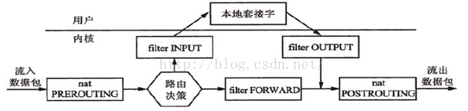
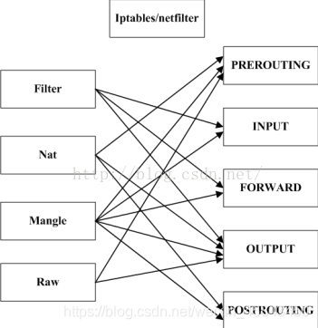

### iptables

https://www.zsythink.net/archives/category/%e8%bf%90%e7%bb%b4%e7%9b%b8%e5%85%b3/iptables

iptables [-t 表名] 选项 [链名] [条件] [-j 控制类型]

-P 设置默认策略:iptables -P INPUT (DROP|ACCEPT)

-F 清空规则链

-L 查看规则链

-A 在规则链的末尾加入新规则

-I num 在规则链的头部加入新规则

-D num 删除某一条规则

-s 匹配来源地址IP/MASK，加叹号"!"表示除这个IP外。

-d 匹配目标地址

-i 网卡名称 匹配从这块网卡流入的数据

-o 网卡名称 匹配从这块网卡流出的数据

-p 匹配协议,如tcp,udp,icmp

--dport num 匹配目标端口号

--sport num 匹配来源端口号


### 5链

      PREROUTING:数据包进入路由表之前  规则可以存在于：raw表，mangle表，nat表。
      
      INPUT:通过路由表后目的地为本机   规则可以存在于：mangle表，filter表，（centos7中还有nat表，centos6中没有）
    
       FORWARD:通过路由表后，目的地不为本机   规则可以存在于：mangle表，filter表。
    
       OUTPUT:由本机产生，向外转发   规则可以存在于：raw表mangle表，nat表，filter表。
    
       POSTROUTIONG:发送到网卡接口之前。 规则可以存在于：mangle表，nat表。



### 4表 

**优先级次序（由高而低）：**

**raw –> mangle –> nat –> filter**


filter表：负责过滤功能，防火墙；内核模块：iptables_filter

nat表：network address translation，网络地址转换功能；内核模块：iptable_nat

mangle表：拆解报文，做出修改，并重新封装 的功能；iptable_mangle

raw表：关闭nat表上启用的连接追踪机制；iptable_raw


表（功能）<–>  链（钩子）：

raw   表中的规则可以被哪些链使用：PREROUTING，OUTPUT

mangle  表中的规则可以被哪些链使用：PREROUTING，INPUT，FORWARD，OUTPUT，POSTROUTING

nat   表中的规则可以被哪些链使用：PREROUTING，OUTPUT，POSTROUTING（centos7中还有INPUT，centos6中没有）

filter  表中的规则可以被哪些链使用：INPUT，FORWARD，OUTPUT




但是，**我们在实际的使用过程中，往往是通过”表”作为操作入****口，对规则进行定义的**，之所以按照上述过程介绍iptables，是因为从”关卡”的角度更容易从入门的角度理解，但是为了以便在实际使用的时候，更加顺畅的理解它们，此处我们还要将各”表”与”链”的关系罗列出来，


### **处理动作**

处理动作在iptables中被称为target（这样说并不准确，我们暂且这样称呼），动作也可以分为基本动作和扩展动作。

此处列出一些常用的动作，之后的文章会对它们进行详细的示例与总结：

**ACCEPT**：允许数据包通过。

**DROP**：直接丢弃数据包，**不给任何回应信息，这时候客户端会感觉自己的请求泥牛入海了，过了超时时间才会有反应**。

**REJECT**：拒绝数据包通过，**必要时会给数据发送端一个响应的信息，客户端刚请求就会收到拒绝的信息**。

**SNAT**：源地址转换，解决内网用户用同一个公网地址上网的问题。

**MASQUERADE**：是SNAT的一种特殊形式，适用于动态的、临时会变的ip上。

**DNAT**：目标地址转换。

**REDIRECT**：在本机做端口映射。

**LOG**：在/var/log/messages文件中记录日志信息，然后将数据包传递给下一条规则，也就是说除了记录以外不对数据包做任何其他操作，仍然让下一条规则去匹配。


### 查询表规则

-t 指定表默认filter 常用的还有nat。 -v详细信息。-n 不解析ip。 –line-numbers

### iptables  --line-numbers -nvL -t filter  

**iptables -t 表名 -L 链名**


**pkts**:对应规则匹配到的报文的个数。

**bytes**:对应匹配到的报文包的大小总和。

**target**:规则对应的target，往往表示规则对应的”动作”，即规则匹配成功后需要采取的措施。

**prot**:表示规则对应的协议，是否只针对某些协议应用此规则。

**opt**:表示规则对应的选项。

**in**:表示数据包由哪个接口(网卡)流入，我们可以设置通过哪块网卡流入的报文需要匹配当前规则。

**out**:表示数据包由哪个接口(网卡)流出，我们可以设置通过哪块网卡流出的报文需要匹配当前规则。

**source**:表示规则对应的源头地址，可以是一个IP，也可以是一个网段。

**destination**:表示规则对应的目标地址。可以是一个IP，也可以是一个网段。


### 删除表

iptables -F INPUT. -t table

iptables --line -vnL INPUT

iptables -t filter -D INPUT 3

iptables -D INPUT -s xxx.xxx.xxx.xxx -j ACCETP


### 修改规则

**注意：上例中， -s选项以及对应的源地址不可省略，即使我们已经指定了规则对应的编号，但是在使用-R选项修改某个规则时，必须指定规则对应的原本的匹配条件（如果有多个匹配条件，都需要指定）**

ipbtale -t filter -R INPUT 1 -s xxx.xxx.xxx.xxx -j REJECT.  ，*


### 新建规则

-I 插入的链 头部插入.  -I INPUT 2   在指定编号插入

-s 原地址

-j 动作

-A 尾部插入

iptables -t filter -I INPUT -s xxx.xxx.xxx.xxx -j DROP


### 保存

```
#配置好yum源以后安装iptables-service
# yum install -y iptables-services
#停止firewalld
# systemctl stop firewalld
#禁止firewalld自动启动
# systemctl disable firewalld
#启动iptables
# systemctl start iptables
#将iptables设置为开机自动启动，以后即可通过iptables-service控制iptables服务
# systemctl enable iptables


service iptables save
iptables-save
iptables-save > /etc/sysconfig/iptables
iptables-restore < /etc/sysconfig/iptables
```


**如果报文已经被前面的规则匹配到，iptables则会对报文执行对应的动作，即使后面的规则也能匹配到当前报文，很有可能也没有机会再对报文执行相应的动作了**


### 匹配条件

-s 匹配报文来源  

- 192.168.1.1,192.168.2.2
- 10.10.10.10/16
- ! -s 192.168.1.1.1


-d 目标地址


-p 协议 tcp, udp, udplite, icmp, icmpv6,esp, ah, sctp, mh


-i 入口网卡 eth4

-o 出口网卡


--sport 源端口。  22:55   22到55端口

--dport 目标端口。80:   80以后所有端口

-m 模块      **如果在没有指明 -m 模块的时候 默认使用-p对应的模块**

- multiport  不连续的端口 --dports  22，33，55
- iprange 指定”一段连续的IP地址范围”  --src-range  --dst-range  --sre-range 192.168.1.1-192.168.1.10
- string  匹配字符串  --algo bm 指定算法 --string "xxxx" 匹配的字符串
- time --timestart 指定开始时间 --timestop 结束时间 --weekdays 6,7
- Connlimit 限制每个IP链接数量  --connlimit-above 2每个ip限制两个链接 --connlimt-mask 24 指定网网
- tcp  --tcp-flags 
- udp. --dport --sport
- Icmp  -m icp --icmp-type 8/0
- limit 限速 --limit 10/minute 每分钟放行10个 需要配置第二条规则 --limit-brust 令牌桶数量
  - Iptables -t filter -I INPUT -p icmp -m limit --limit 10/minute -j ACCEPT
  - Iptables -t filter _I input -p icmp -j REJECT


### 自定义规则

iptables -t filter -N 新规则

iptables -I my -t filter -s 172.26.0.109 -p icmp -j DROP

iptables -L my -t filter


iptables -I INPUT -p icmp -J my 加入到

iptables -X my 删除自定义表  必须删除引用


### 转发

```
#如果想要iptables作为网络防火墙，iptables所在主机开启核心转发功能，以便能够转发报文。
#使用如下命令查看当前主机是否已经开启了核心转发，0表示为开启，1表示已开启
cat /proc/sys/net/ipv4/ip_forward
#使用如下两种方法均可临时开启核心转发，立即生效，但是重启网络配置后会失效。
方法一：echo 1 > /proc/sys/net/ipv4/ip_forward
方法二：sysctl -w net.ipv4.ip_forward=1
#使用如下方法开启核心转发功能，重启网络服务后永久生效。
配置/etc/sysctl.conf文件（centos7中配置/usr/lib/sysctl.d/00-system.conf文件），在配置文件中将 net.ipv4.ip_forward设置为1
 
#由于iptables此时的角色为"网络防火墙"，所以需要在filter表中的FORWARD链中设置规则。
#可以使用"白名单机制"，先添加一条默认拒绝的规则，然后再为需要放行的报文设置规则。
#配置规则时需要考虑"方向问题"，针对请求报文与回应报文，考虑报文的源地址与目标地址，源端口与目标端口等。
#示例为允许网络内主机访问网络外主机的web服务与sshd服务。
iptables -A FORWARD -j REJECT
iptables -I FORWARD -s 10.1.0.0/16 -p tcp --dport 80 -j ACCEPT
iptables -I FORWARD -d 10.1.0.0/16 -p tcp --sport 80 -j ACCEPT
iptables -I FORWARD -s 10.1.0.0/16 -p tcp --dport 22 -j ACCEPT
iptables -I FORWARD -d 10.1.0.0/16 -p tcp --sport 22 -j ACCEPT
 
#可以使用state扩展模块，对上述规则进行优化，使用如下配置可以省略许多"回应报文放行规则"。
iptables -A FORWARD -j REJECT
iptables -I FORWARD -s 10.1.0.0/16 -p tcp --dport 80 -j ACCEPT
iptables -I FORWARD -s 10.1.0.0/16 -p tcp --dport 22 -j ACCEPT
iptables -I FORWARD -m state --state ESTABLISHED,RELATED -j ACCEPT
```


### 动作

### reject

-j REJECT--reject-with

- icmp-net-unreachable
- icmp-host-unreachable
- icmp-port-unreachable
- icmp-proto-unreachable
- icmp-net-prohibited
- icmp-host-pro-hibited
- icmp-admin-prohibited


### log

-J LOG

查看/var/log/messages即可看到对应报文的相关信息

–log-level选项可以指定记录日志的日志级别，可用级别有emerg，alert，crit，error，warning，notice，info，debug。

–log-prefix选项可以给记录到的相关信息添加”标签”之类的信息，以便区分各种记录到的报文信息，方便在分析时进行过滤。


### NAT

https://blog.csdn.net/cici_new_1987/article/details/114364669

snat source network translation 源地址转换

dnat destination netwrok translation 目标地址转换


#### snat

iptables -t nat -A POSTROUTING -s 10.1.0.0/16 -j SNAT  -- to-source 192.167.1.1 将匹配到的豹纹ip修改为192.167.1.1

 tcpdump - i 网卡  -nn icmp


#### dnat

iptables -t nat -A PREROUTING -d 192.168.1.1 -p tcp --dport 3389 -j DNAT --to-destionation 10.0.0.1:3306


#### MASQUERADE

MASQUERADE**会动态的将源地址转换为可用的IP地址**，

iptables -t nat -I POSTROUTING -s 10.10.10.10/16 -o 网卡 -j MASQUERADE


#### REDIRECT

比如，将本机的80端口映射到本机的8080端口上

**REDIRECT规则只能定义在PREROUTING链或者OUTPUT链中。**

iptables -t nat -A PREROUTING -p tcp –dport 80 -j REDIRECT –to-ports 8080


**如果想要NAT功能能够正常使用，需要开启Linux主机的核心转发功能**

**echo 1 > /proc/sys/net/ipv4/ip_forward**


