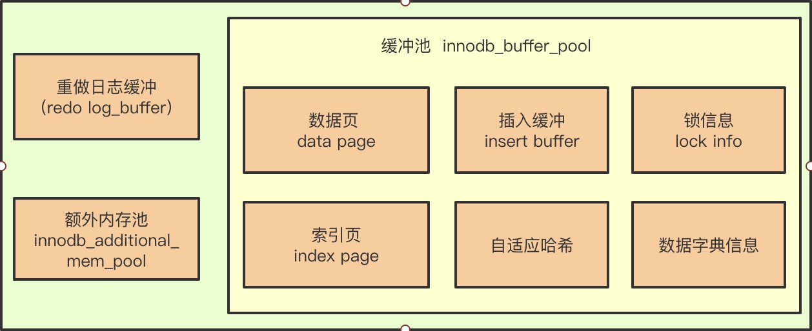

### 插入缓冲

https://blog.csdn.net/luqiang81191293/article/details/109364255

今天我们的主题就是 插入缓冲（Insert Buffer）,由于InnoDB引擎底层数据存储结构式B+树，而对于索引我们又有聚集索引和非聚集索引。

在进行数据插入时必然会引起索引的变化，聚集索引不必说，一般都是递增有序的**。而非聚集索引就不一定是什么数据了，其离散性导致了在插入时结构的不断变化，从而导致插入性能降低。**

所以为了解决非聚集索引插入性能的问题，InnoDB引擎 创造了Insert Buffer。

**只能对非聚簇索引有效**,**并且索引不唯一**

insert Buffer 就是用于提升非聚集索引页的插入性能的，其数据结构类似于数据页的一个B+树，物理存储在共享表空间ibdata1中 。

