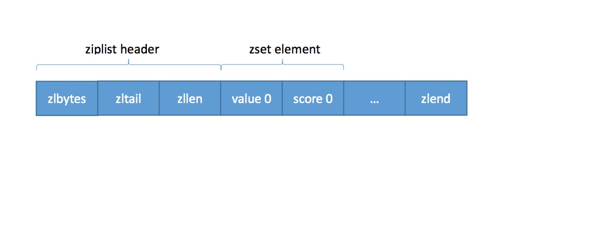

### zset

https://www.jianshu.com/p/fb7547369655

## zset底层存储结构

 zset底层的存储结构包括ziplist或skiplist，在同时满足以下两个条件的时候使用ziplist，其他时候使用skiplist，两个条件如下：

- 有序集合保存的**元素数量小于128个**
- 有序集合保存的**所有元素的长度小于64字节**


当ziplist作为zset的底层存储结构时候，每个集合元素使用两个紧挨在**一起的压缩列表节点来保存**，第一个节点保存元素的成员，第二个元素保存元素的分值。


当skiplist作为zset的底层存储结构的时候，**使用skiplist按序保存元素及分值**，使用dict来保存元素和分值的映射关系。


## ziplist数据结构

 ziplist作为zset的存储结构时，格式如下图，细节就不多说了，我估计大家都看得懂，紧挨着的是元素memeber和分值socore，整体数据是有序格式



 zset包括dict和zskiplist两个数据结构，其中dict的保存key/value，便于通过key(元素)获取score(分值)。zskiplist保存有序的元素列表，便于执行range之类的命令。

```cpp
/*
 * 有序集合
 */
typedef struct zset {

    // 字典，键为成员，值为分值
    // 用于支持 O(1) 复杂度的按成员取分值操作
    dict *dict;

    // 跳跃表，按分值排序成员
    // 用于支持平均复杂度为 O(log N) 的按分值定位成员操作
    // 以及范围操作
    zskiplist *zsl;

} zset;
```

zskiplist作为skiplist的数据结构，包括指向头尾的header和tail指针，其中level保存的是skiplist的最大的层数。

```c
/*
 * 跳跃表
 */
typedef struct zskiplist {
    // 表头节点和表尾节点
    struct zskiplistNode *header, *tail;
    // 表中节点的数量
    unsigned long length;
    // 表中层数最大的节点的层数
    int level;
} zskiplist;
```

 skiplist跳跃列表中每个节点的数据格式，每个节点有保存数据的robj指针，分值score字段，后退指针backward便于回溯，zskiplistLevel的数组保存跳跃列表每层的指针。

```cpp
/*
 * 跳跃表节点
 */
typedef struct zskiplistNode {
    // 成员对象
    robj *obj;
    // 分值
    double score;
    // 后退指针
    struct zskiplistNode *backward;
    // 层
    struct zskiplistLevel {
        // 前进指针
        struct zskiplistNode *forward;
        // 跨度
        unsigned int span;
    } level[];
} zskiplistNode;
```