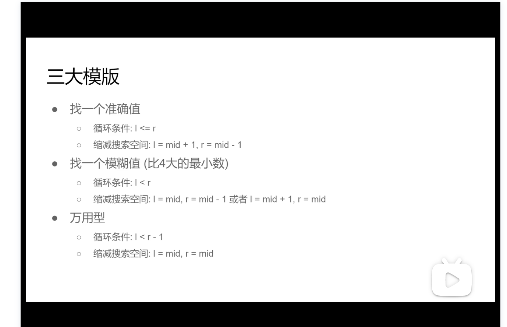

#### **BinarySearch**

https://www.cnblogs.com/kyoner/p/11080078.html


https://www.bilibili.com/video/BV1Ng4y1q7E3?from=search&seid=14226149614246578755

https://www.bilibili.com/video/BV1d54y1q7k7?from=search&seid=14226149614246578755




while(left <= right)的终止条件是 left == right + 1

while(left < right)的终止条件是 left == right


```go
寻找左边间
func leftSearch(arr []int, find int) int {
	l := 0
	r := len(arr)
	for l < r {
		m := (l + r) / 2
		if arr[m] >= find {
			r = m
		} else {
			l = m + 1
		}
	}
	return l
}

寻找右边界
func rightSearch(arr []int, find int) int {
	l := 0
	r := len(arr)
	for l < r {
		m := (l + r) / 2
		if arr[m] == find {
			l = m + 1
		} else if arr[m] < find {
			l = m + 1
		} else {
			r = m
		}
	}
	return r - 1
}


func basicBinarySearch(arr []int, find int) int {
	l := 0
	r := len(arr) - 1 // 注意
	for l <= r {      // 注意    两端都闭区间 [left, right]，
		m := (l + r) / 2
		if arr[m] == find {
			return m
		} else if arr[m] > find {
			r = m - 1
		} else {
			l = m + 1
		}
	}
	return -1
}

```


第一个，最基本的二分查找算法：

```java
因为我们初始化 right = nums.length - 1
所以决定了我们的「搜索区间」是 [left, right]
所以决定了 while (left <= right)
同时也决定了 left = mid+1 和 right = mid-1

因为我们只需找到一个 target 的索引即可
所以当 nums[mid] == target 时可以立即返回
```

第二个，寻找左侧边界的二分查找：

```java
因为我们初始化 right = nums.length
所以决定了我们的「搜索区间」是 [left, right)
所以决定了 while (left < right)
同时也决定了 left = mid+1 和 right = mid

因为我们需找到 target 的最左侧索引
所以当 nums[mid] == target 时不要立即返回
而要收紧右侧边界以锁定左侧边界
```

第三个，寻找右侧边界的二分查找：

```java
因为我们初始化 right = nums.length
所以决定了我们的「搜索区间」是 [left, right)
所以决定了 while (left < right)
同时也决定了 left = mid+1 和 right = mid

因为我们需找到 target 的最右侧索引
所以当 nums[mid] == target 时不要立即返回
而要收紧左侧边界以锁定右侧边界

又因为收紧左侧边界时必须 left = mid + 1
所以最后无论返回 left 还是 right，必须减一
```